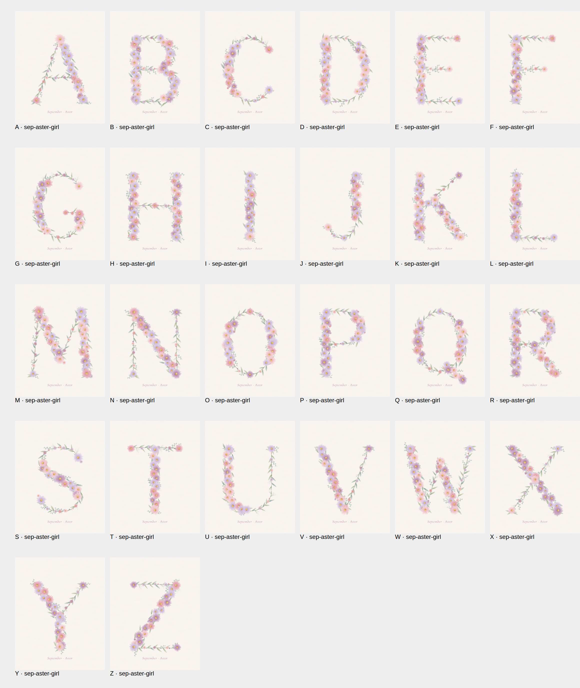

# Birth-Month Floral Alphabet

Printable nursery / baby-shower letters. Each letter is built from that month's birth flower,
in a girl palette and a boy palette. The letters are generated in code, so a new letter, colourway
or month is a render, not a repaint.



## Status

| Theme | Letters | Notes |
|---|---|---|
| September · Aster (girl / boy) | A–Z done, all sizes exported and packaged | first product to list |
| July · Larkspur (girl / boy) | A–Z geometry works, not reviewed letter by letter | |
| Other 10 months | not started | one new flower drawing each |

## Run

Needs Node and Playwright with Chromium (the script points at `/opt/pw-browsers/chromium-1194`;
change `executablePath` in `generate.js` / `mockups.js` for another machine).

```sh
node generate.js sep-aster-girl ABCDEFGHIJKLMNOPQRSTUVWXYZ   # out/<L>-sep-aster-girl.png + out/sheet.png
NOCAP=1 node generate.js sep-aster-girl MAI                   # no "September · Aster" caption, for banners
node mockups.js                                               # listing images (needs M, A, I, S rendered above)
```

Etsy download (all sizes, then five zips under 20 MB each, each with a printing-guide PDF):

```sh
EXPORT=1 node generate.js sep-aster-girl    # out/export/sep-aster-girl/<size>/<L>.jpg, ~5 min
node package.js sep-aster-girl              # out/etsy/sep-aster-girl/*.zip
node listing-images.js sep-aster-girl       # out/etsy/sep-aster-girl/images/*.jpg, 3000x2250 (needs both colourways exported)
```

| Zip | Contents | Pixels (300 dpi) | Size |
|---|---|---|---|
| 1 | 5×7 + 5×7 without caption (banner) | 1500×2100 | ~13 MB |
| 2 | 8×10 | 2400×3000 | ~14 MB |
| 3 | 11×14 | 3300×4200 | ~13 MB |
| 4 | A4 | 2480×3508 | ~14 MB |
| 5 | A3 | 3508×4961 | ~14 MB |

JPEG quality is set per size (`QUALITY` in `generate.js`) to stay under the limit; `package.js` fails if a zip goes over 20 MB.

Themes: `jul-larkspur-girl`, `jul-larkspur-boy`, `sep-aster-girl`, `sep-aster-boy`.
Output is 2400×3000 px (8×10 in at 300 dpi) and is deterministic: the same command gives the same file.

## How it works

- `LETTERS` in `generate.js` describes each letter as strokes (lines, arcs, beziers) marked thick or thin,
  like a Didone serif face. Thick strokes get dense blooms, thin strokes become leafy vines.
- `makeTheme()` supplies the flower, foliage and palette for a month and gender.
- Watercolour look comes from gradient petals, SVG displacement for soft edges, pigment grain and a paper texture.

## Still to do before listing

Listing copy: `listings/september-aster.txt` (shop Sumikiri, section Birth Flower Letters).


- Add a real photo mockup (framed on a wall) as listing image 2.

Fonts: Cormorant Garamond and Great Vibes, both SIL Open Font License.
